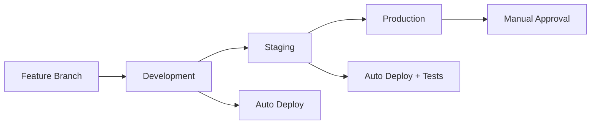
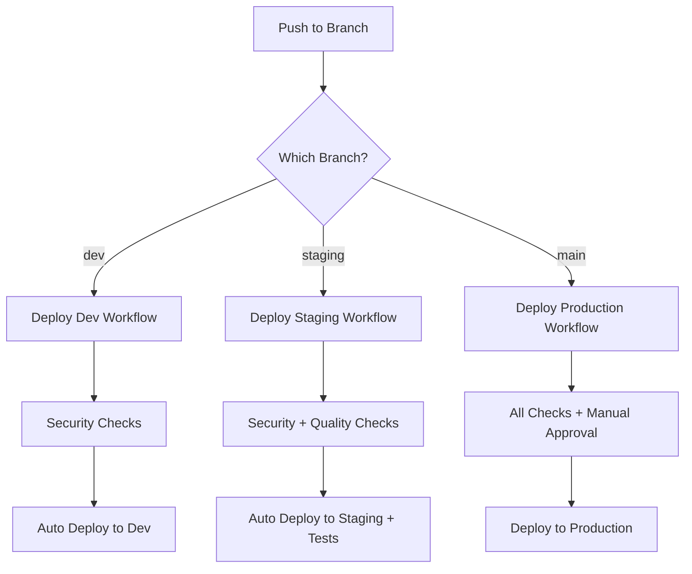

# Altered: Neuro-Inclusive Executive Function Companion

[](https://github.com/your-username/neuropilot/actions/workflows/deploy.yml)
[](https://github.com/your-username/neuropilot/actions/workflows/deploy-staging.yml)
[](https://github.com/your-username/neuropilot/actions/workflows/deploy-dev.yml)
[](https://github.com/your-username/neuropilot/actions/workflows/trufflehog.yml)

## 🌍 Environments

| Environment | Branch | Status | URL |
|-------------|--------|--------|-----|
| 🏭 **Production** | `main` | [](https://neuropilot-23fb5.web.app) | [neuropilot-23fb5.web.app](https://neuropilot-23fb5.web.app) |
| 🧪 **Staging** | `staging` | [](https://neuropilot-staging.web.app) | [neuropilot-staging.web.app](https://neuropilot-staging.web.app) |
| 🔧 **Development** | `dev` | [](https://neuropilot-dev.web.app) | [neuropilot-dev.web.app](https://neuropilot-dev.web.app) |

## 1. Problem Statement

### The Challenge: Executive Dysfunction
Neurodivergent adults (particularly those with ADHD and Autism) often struggle with **executive function**—the mental skills required to plan, focus attention, remember instructions, and juggle multiple tasks. Common challenges include:

*   **Time Blindness**: Difficulty perceiving the passage of time or estimating how long tasks take.
*   **Analysis Paralysis**: Inability to make decisions when faced with multiple options.
*   **Task Inertia**: Difficulty starting tasks (initiation) or stopping them (hyperfocus).
*   **Working Memory Deficits**: Losing track of context, goals, or items when interrupted.
*   **Sensory/Energy Dysregulation**: Burnout from pushing through sensory overwhelm or energy lows.

### Importance
Traditional productivity tools (calendars, to-do lists) often fail this demographic because they *require* executive function to maintain. They add cognitive load rather than reducing it. There is a critical need for a supportive, intelligent system that acts as an "external frontal lobe"—proactively managing these deficits without judgment.

---

## 2. Solution Overview

**Altered** is a multi-agent AI system designed specifically as an executive function prosthetic. Unlike passive tools, Altered proactively adapts to the user's "brain state" (Focused, Scattered, Overwhelmed) and routes requests to specialized agents.

### Application Overview
- **Purpose and Goals**: Altered aims to provide neuro-inclusive support for executive function challenges, helping users manage time, tasks, decisions, and energy levels through AI-driven assistance. The goal is to reduce cognitive overload, enhance productivity, and promote well-being for neurodivergent individuals.
- **Key Features and Functionalities**:
  - **Task Atomization**: Breaking overwhelming projects into "micro-steps" (e.g., "Write report" → "Open document").
  - **Time Anchoring**: Visualizing time realistically and providing "transition warnings" rather than abrupt alarms.
  - **Decision Support**: Reducing choice overload by curating options and offering "gentle defaults."
  - **Body Doubling**: Providing a virtual presence to assist with task initiation and maintenance.
  - **Context Restoration**: "External Brain" agent remembers where you left off, restoring context after interruptions.
  - **Energy Monitoring**: Detecting burnout patterns in communication and enforcing rest.
  - **Voice Interaction (New)**: Hands-free interaction using **Hybrid TTS** (Piper + Google Cloud) and **Smart STT** for natural, punctuation-aware conversations.
  - **Agent Persona**: Strictly defined "Altered" persona that avoids generic AI disclaimers ("I am an AI") to maintain immersion.
  - Integration with Google Calendar for scheduling and event management.
- **Target Audience and Use Cases**:
  - **Audience**: Neurodivergent adults (e.g., those with ADHD, Autism) facing executive dysfunction.
  - **Use Cases**: Daily task management, time-sensitive reminders, decision-making support during high-stress periods, context recovery after interruptions, and energy-aware scheduling.

### Key Features
*   **Task Atomization**: Breaking overwhelming projects into "micro-steps" (e.g., "Write report" → "Open document").
*   **Time Anchoring**: Visualizing time realistically and providing "transition warnings" rather than abrupt alarms. Includes time estimation correction based on user's historical accuracy patterns and hyperfocus detection with intervention levels.
*   **Decision Support**: Reducing choice overload by curating options and offering "gentle defaults."
*   **Body Doubling**: Providing a virtual presence to assist with task initiation and maintenance.
*   **Context Restoration**: "External Brain" agent remembers where you left off, restoring context after interruptions.
*   **Energy Monitoring**: Detecting burnout patterns in communication and enforcing rest.
*   **Voice Mode**:
    *   **Gemini Live (New)**: Real-time bidirectional voice using Gemini 2.0 Flash Live API with WebSocket streaming, built-in voice activity detection, and native audio I/O.
    *   **Hybrid TTS**: Seamlessly switches between **Piper TTS** (local, low-latency, privacy-focused) and **Google Cloud TTS** (high-quality, natural voices) based on network availability and user preference.
    *   **Smart STT**: Powered by **Google Cloud Speech-to-Text**, providing accurate, punctuated transcriptions (e.g., "Hello, I am Bishal. How are you?" instead of "hello i am bishal how are you").
    *   **Emoji Filtering**: Intelligent speech synthesis that automatically removes emojis (e.g., "😊", "🚀") from the spoken output to ensure a natural, non-disruptive conversation flow.
*   **Agent Persona**:
    *   **Executive Function Prosthetic**: The AI acts as a "prosthetic frontal lobe," not a generic assistant.
    *   **Identity Protection**: Strictly instructed *never* to identify as "an AI language model," maintaining the immersive "Altered" persona.
*   **Intelligent Energy Logging**:
    *   **Proactive Detection**: The agent analyzes conversation tone and context to automatically infer and log energy levels (1-10) without requiring explicit commands.
    *   **Smart Keywords**: Detects phrases like "exhausted" (Level 1) or "pumped" (Level 9) to trigger automatic logging.
    *   **Seamless Sync**: Automatically synchronizes inferred energy levels with the local device storage for offline access and history tracking.

#### Examples
- Time: "Set a countdown for 5 minutes" → time perception agent uses `create_countdown` and returns target time plus warnings.
- Time Estimation: "This task should take 30 minutes" → time perception agent uses `estimate_real_time` and responds "Based on your history, tasks you estimate at 30 min usually take 54 min. I recommend planning 65 minutes with buffer."
- Hyperfocus Protection: After 2+ hours of work → time perception agent uses `detect_hyperfocus` and interrupts with "🚨 HYPERFOCUS ALERT: You've been working too long. Stop NOW. Bathroom, water, food - in that order."
- Taskflow: "Atomize this project into micro-steps" → taskflow agent uses `atomize_task` and returns a micro-steps list.
- Decision: "I have too many choices; can't decide" → decision support agent uses `reduce_options` and provides 3 defaults.
- External Brain: "Capture a voice note: met with team; remember follow-ups" → external brain agent uses `capture_voice_note` and stores a task.
- Energy/Sensory: "I feel overstimulated in this crowded place" → energy/sensory agent uses `detect_sensory_overload` and suggests balance via `routine_vs_novelty_balancer`.
- Body Double: "Start body double" → coordinator starts body-doubling presence; inactivity triggers a gentle check-in with an energy logging prompt.
- Voice Mode: "Hello, I'm feeling stuck" → User speaks naturally; Agent replies with a calm, non-robotic voice: "I hear you. Let's just take one small step."
- Energy Logging: "I am absolutely drained today" → Agent detects low energy (Level 1-2), logs it automatically, and responds: "I noticed you're low on energy. Let's switch to gentle mode."

---

## 3. System Architecture

Altered utilizes a **Client-Server** architecture powered by **Google's Agent Development Kit (ADK)** and **Gemini** models.

### Architecture Documentation
- **High-Level System Architecture Diagram**:

```mermaid
graph TD
    subgraph Client [Flutter Frontend]
        UI[Mobile/Web UI]
        State[Riverpod State]
        Voice[Voice Services]
    end

    subgraph Backend [Python API Server]
        API[FastAPI Gateway]
        Orch[Coordinator Agent]
        
        subgraph Agents [Specialized Agents]
            TF[TaskFlow Agent]
            TP[Time Perception Agent]
            DS[Decision Support Agent]
            ES[Energy/Sensory Agent]
            EB[External Brain Agent]
        end
        
        subgraph VoiceServices [Voice Processing]
            Piper[Piper TTS (Local)]
            GCloud[Google Cloud TTS/STT]
            GeminiLive[Gemini Live API]
        end
        
        Storage[Session Service]
    end

    subgraph Cloud [Infrastructure]
        Gemini[Google Gemini LLM]
        Fire[Firestore DB]
    end

    UI <--> API
    API --> Orch
    API --> VoiceServices
    Orch --> TF & TP & DS & ES & EB
    Agents <--> Gemini
    Agents <--> Storage
    Storage <--> Fire
```

- **Component-Level Diagram** (Detailed Breakdown):

```mermaid
graph TD
    User -->|Input (Text/Voice)| FlutterUI[Flutter UI]
    FlutterUI -->|API Calls| FastAPI[FastAPI Gateway]
    FastAPI -->|Route Request| Coordinator[Coordinator Agent]
    Coordinator -->|Delegate Task| SpecializedAgents[Specialized Agents]
    SpecializedAgents -->|Query LLM| GeminiAPI[Gemini API]
    SpecializedAgents -->|Store/Retrieve| Firestore[Firestore DB]
    Firestore -->|Sync| SessionService[Session Service]
    FlutterUI -->|Local State| Riverpod[Riverpod State Management]
    
    subgraph Voice Integration
        FlutterUI -->|Audio Stream| STTService[STT Service]
        STTService -->|Transcribe| GoogleSTT[Google Cloud STT]
        Coordinator -->|Text Response| TTSService[TTS Service]
        TTSService -->|Synthesize| PiperOrGoogle[Piper / Google TTS]
        PiperOrGoogle -->|Audio Blob| FlutterUI
    end
```

- **Data Flow Descriptions**:
  - **User Input Flow**: User interacts via Flutter UI (text or voice). Requests are sent to FastAPI, routed by the Coordinator Agent to appropriate Specialized Agents. Agents process using Gemini LLM and store results in Firestore.
  - **Response Flow**: Agents generate responses, which are returned via FastAPI to the Flutter UI for display. Local state (Riverpod) handles UI updates and caching.
  - **Voice Interaction**: Voice input is captured via `record` package (Opus/WebM), sent to backend for transcription (Google STT), processed by agents, and response text is synthesized (Piper/Google TTS) and played back.
  - **Session Management**: All interactions are tied to sessions stored in Firestore for persistence and real-time sync.

- **Technology Stack Breakdown**:
  - **Frontend**: Flutter (Dart) for cross-platform UI, Riverpod for state management.
  - **Backend**: Python with FastAPI, Google ADK for agent orchestration, Gemini LLM for AI processing.
  - **Database**: Firestore for real-time data sync.
  - **Voice**: Piper TTS (ONNX-based), Google Cloud Text-to-Speech, Google Cloud Speech-to-Text.
  - **Other**: Docker for containerization, GitHub Actions for CI/CD, Google Cloud Run for deployment.

### Components
1.  **Frontend (Flutter)**: A cross-platform (Android/iOS/Web) interface focused on minimal cognitive load.
    *   **Neuro-Inclusive UI**: Features "Focus Mode," reduced animations, and calm color palettes.
    *   **Voice Mode**: Integrated voice recording and playback with visual feedback.
    *   **State Management**: Uses Riverpod for robust state handling.
2.  **Backend (Python/ADK)**:
    *   **Coordinator Agent**: Analyzes user intent and brain state to route tasks.
    *   **Specialized Agents**: Independent LLM-driven agents with specific "personalities" and tools.
    *   **Voice Services**: Hybrid TTS (Local fallback + Cloud high-quality) and STT integration.
    *   **Session Management**: Hybrid storage using in-memory speed and Firestore durability.
3.  **Data Layer**:
    *   **Firestore**: Persists chat history, user patterns, and long-term memory.

### Technology Choices
*   **Flutter**: Single codebase for mobile and web, high-performance rendering.
*   **Python + Google ADK**: Native integration with Gemini; flexible agent orchestration.
*   **Firestore**: Real-time sync and flexible schema for evolving agent memory.
*   **Piper TTS**: Low-latency, privacy-preserving local text-to-speech option.

---

## 4. Development Setup

### 🚀 Quick Start

Choose your development approach:

#### Option A: Local Development
```bash
# 1. Clone and setup
git clone https://github.com/your-username/neuropilot.git
cd neuropilot

# 2. Backend setup
python -m venv venv
source venv/bin/activate  # Windows: venv\Scripts\activate
pip install -r requirements.txt

# 3. Configure environment
cp .env.example .env
# Edit .env with your API keys

# 4. Validate setup (optional but recommended)
python test_deployment_fix.py

# 5. Start backend
uvicorn api_server:app --host 0.0.0.0 --port 8000 --reload

# 6. Frontend setup (new terminal)
cd frontend/flutter_neuropilot
flutter pub get
flutter run -d chrome --web-port=8081
```

#### Option B: Development Environment Deployment
```bash
# Deploy to development environment
git checkout -b feature/my-feature
git push origin feature/my-feature

# Create PR to 'dev' branch for automatic deployment
# Access at: https://neuropilot-dev.web.app
```

### 📋 Prerequisites

#### System Requirements
- **Operating System**: macOS, Linux, or Windows (WSL recommended)
- **Tools**: 
  - Python 3.10+
  - Flutter SDK (latest stable)
  - Node.js 18+ (for MCP server)
  - Docker (optional, for containerization)
  - Git (for version control)

#### Required Accounts & Services
- **Google Cloud Project** with Gemini API enabled
- **Firebase Project** with Firestore and Hosting
- **GitHub Account** (for CI/CD and version control)

### 🔧 Detailed Setup Instructions

#### 1. Repository Setup
```bash
git clone https://github.com/your-username/neuropilot.git
cd neuropilot
```

#### 2. Backend Configuration
```bash
# Create virtual environment
python -m venv venv
source venv/bin/activate  # Windows: venv\Scripts\activate

# Install dependencies
pip install -r requirements.txt

# Setup voice models (optional)
python scripts/setup_voice.py
```

#### 3. Environment Configuration
Create `.env` file in the root directory:
```env
# Core API Keys
GOOGLE_API_KEY=your_gemini_api_key
FIREBASE_CREDENTIALS=path/to/firebase-service-account.json
PROJECT_ID=your-project-id

# Optional Configuration
DEFAULT_MODEL=gemini-2.0-flash
ENVIRONMENT=development

# Voice Services (optional)
GOOGLE_CLOUD_TTS_ENABLED=true
PIPER_TTS_ENABLED=true
```

#### 4. Firebase Setup
```bash
# Install Firebase CLI
npm install -g firebase-tools

# Login and initialize
firebase login
firebase init hosting

# Configure for multiple environments (optional)
firebase use --add  # Add development project
firebase use --add  # Add staging project
```

#### 5. Start Development Servers
```bash
# Backend (Terminal 1)
uvicorn api_server:app --host 0.0.0.0 --port 8000 --reload

# Frontend (Terminal 2)
cd frontend/flutter_neuropilot
flutter pub get
flutter run -d chrome --web-port=8081
```

### 🌐 Multi-Environment Setup

This project supports three environments with automatic deployment:

#### Development Environment (`dev` branch)
- **Purpose**: Feature development and testing
- **Deployment**: Automatic on push to `dev` branch
- **Resources**: Minimal (1 CPU, 1Gi RAM, max 5 instances)
- **URL**: `https://neuropilot-dev.web.app`

#### Staging Environment (`staging` branch)
- **Purpose**: Pre-production testing and QA
- **Deployment**: Automatic on push to `staging` branch
- **Resources**: Production-like (2 CPU, 2Gi RAM, max 10 instances)
- **Features**: Includes smoke tests and validation
- **URL**: `https://neuropilot-staging.web.app`

#### Production Environment (`main` branch)
- **Purpose**: Live application for end users
- **Deployment**: Manual approval required
- **Resources**: Full production specs (2 CPU, 2Gi RAM)
- **Security**: Enhanced monitoring and alerting
- **URL**: `https://neuropilot-23fb5.web.app`

### 🔒 Security

This repository implements comprehensive security measures:

#### Automated Security Checks
- **Secret Scanning**: TruffleHog scans for hardcoded credentials
- **Dependency Scanning**: Automated vulnerability detection
- **Code Quality**: Flutter analysis and Python linting
- **Environment Isolation**: Separate secrets and infrastructure per environment

### Setup Instructions
- **System Requirements and Dependencies**:
  - **Operating System**: macOS, Linux, or Windows (with WSL for best compatibility).
  - **Tools**: Python 3.10+, Flutter SDK (latest stable), Node.js (for MCP server), Docker (optional for containerization).
  - **Accounts**: Google Cloud Project with Gemini API enabled, Firebase Project with Firestore.

- **Detailed Step-by-Step Installation Guide**:
  1.  **Clone the repository**:
      ```bash
      git clone https://github.com/BishalBudhathoki/alterred.git
      cd altered
      ```

  2.  **Create Virtual Environment**:
      ```bash
      python -m venv venv
      source venv/bin/activate  # Windows: venv\Scripts\activate
      ```

  3.  **Install Dependencies**:
      ```bash
      pip install -r requirements.txt
      ```

  4.  **Voice Setup**:
      Install Piper TTS and download voice models:
      ```bash
      python3 scripts/setup_voice.py
      ```

  5.  **Configuration Options and Environment Variables**:
      Create a `.env` file in the root directory with the following:
      ```env
      GOOGLE_API_KEY=your_gemini_api_key
      FIREBASE_CREDENTIALS=path/to/firebase-service-account.json
      PROJECT_ID=your-project-id
      DEFAULT_MODEL=gemini-2.5-flash  # Optional: Specify LLM model
      ```

  6.  **Start Server**:
      ```bash
      uvicorn api_server:app --host 0.0.0.0 --port 8000 --reload
      ```

### Frontend Setup

1.  **Navigate to Frontend**:
    ```bash
    cd frontend/flutter_neuropilot
    ```

2.  **Install Packages**:
    ```bash
    flutter pub get
    ```

3.  **Run Application**:
    *   **Web (Chrome)**:
        ```bash
        # Uses scripts/run_local.sh for convenience
        ./scripts/run_local.sh
        ```
    *   **Android Emulator**:
        ```bash
        # Uses scripts/android_dev_run.sh
        ./scripts/android_dev_run.sh --device emulator-5554
        ```

> **Note**: Ensure the backend is running before starting the frontend.

---

## 5. Usage Guide

### Basic Operation
1.  **Login/Signup**: Create an account to sync your preferences and history across devices.
2.  **Home Screen**: The chat interface is the central hub.
3.  **Interaction**:
    *   Type or speak your current challenge (e.g., "I'm overwhelmed by this report").
    *   The **Coordinator** detects "Overwhelm" and activates the **TaskFlow Agent**.
    *   The agent breaks the task down: "Let's just open the document first."

### Voice Mode Configuration
1.  Go to **Settings**.
2.  Under **Voice Settings**, choose your preferred **Voice** (e.g., Google Journey or Piper Lessac).
3.  Select **Quality** (Low/Medium/Standard).
4.  Select **Speech-to-Text Provider** (Device for offline, Cloud for higher accuracy).

### Usage Examples
- **Code Snippets**:
  - **Creating a Timer (Frontend Example)**:
    ```dart
    void _startCountdown(String timerId, String targetIso, {int? durationSeconds}) {
      DateTime target;
      if (durationSeconds != null && durationSeconds > 0) {
        target = DateTime.now().add(Duration(seconds: durationSeconds));
      } else {
        target = DateTime.parse(targetIso);
      }
      // ... (rest of timer logic)
    }
    ```
  - **Backend Agent Call (Python Example)**:
    ```python
    async def create_countdown(text: str):
        # Parse duration and return target time and duration_seconds
        secs = parse_seconds(text)
        target_time = datetime.now(timezone) + timedelta(seconds=secs)
        return {"target": target_time.isoformat(), "duration_seconds": secs}
    ```

- **Screenshots or GIFs**:
  - Chat Interface: 
  - Timer in Action: 
  - (Note: Add actual image paths or links in your repository.)

- **API Documentation** (if applicable):
  - **Endpoint**: `/chat/respond` (POST)
    - **Description**: Sends user message to coordinator agent.
    - **Request Body**: `{"text": "User message", "session_id": "abc123"}`
    - **Response**: `{"text": "AI response", "tools": []}`
  - **Endpoint**: `/tts/speak` (POST)
    - **Description**: Synthesizes speech from text.
    - **Request Body**: `{"text": "Hello", "voice": "en-US-lessac", "quality": "medium"}`

### Common Use Cases

| Scenario | User Input | Active Agent | System Response |
| :--- | :--- | :--- | :--- |
| **Task Paralysis** | "I have too much to do." | TaskFlow | Offers to list tasks and pick just *one* to start for 5 minutes. |
| **Time Blindness** | "I have a meeting in an hour." | Time Perception | "That's actually 45 mins of work + 15 mins transition. Based on your history, tasks you estimate at 30 minutes usually take 54 minutes. Start wrapping up at X." |
| **Decision Fatigue** | "What should I eat for lunch?" | Decision Support | Presents 3 curated options based on past energy levels. |
| **Context Loss** | "Where was I?" | External Brain | "You were working on the API docs, section 3. Last edit was 2 hours ago." |

---

## 6. Project Structure

```text
altered/
├── agents/                 # Specialized agent implementations
│   ├── decision_support_agent.py
│   ├── taskflow_agent.py
│   └── ...
├── frontend/               # Flutter mobile/web application
│   └── flutter_neuropilot/
├── orchestration/          # Workflow definitions (Sequential/Parallel)
├── services/               # Core services (Auth, Firestore, Memory, Voice)
│   ├── gemini_live_service.py  # Real-time voice via Gemini Live API
│   ├── google_tts_service.py
│   ├── google_stt_service.py
│   ├── piper_service.py
│   └── voice_manager.py
├── sessions/               # Session storage logic
├── scripts/                # Deployment and utility scripts
├── .github/workflows/      # CI/CD definitions
├── api_server.py           # FastAPI entry point
├── voice_models/           # Downloaded ONNX models for Piper
└── requirements.txt        # Python dependencies
```

---

## 7. Deployment & DevOps

### 🚀 Multi-Environment Deployment Strategy

This project implements a robust CI/CD pipeline with three environments:



#### Deployment Workflow
1. **Feature Development**: Create feature branch from `dev`
2. **Development Testing**: Merge to `dev` → Auto-deploy to development environment
3. **Staging Validation**: Merge to `staging` → Auto-deploy with smoke tests
4. **Production Release**: Merge to `main` → Manual approval → Production deployment

### 🔧 Environment Configuration

#### GitHub Secrets (Required)
Configure in `Settings > Secrets and variables > Actions`:

**Production Secrets** (Required for all environments):
```bash
FIREBASE_API_KEY=AIza...
FIREBASE_APP_ID=1:848026269314:web:...
FIREBASE_MESSAGING_SENDER_ID=848026269314
FIREBASE_PROJECT_ID=neuropilot-23fb5
FIREBASE_AUTH_DOMAIN=neuropilot-23fb5.firebaseapp.com
FIREBASE_STORAGE_BUCKET=neuropilot-23fb5.firebasestorage.app
FIREBASE_MEASUREMENT_ID=G-...

GOOGLE_API_KEY=AIza...
GOOGLE_OAUTH_CLIENT_ID=848026269314-...
GOOGLE_OAUTH_CLIENT_SECRET=GOCSPX-...

ENCRYPTION_KEY=<32-byte-base64-key>
ADMIN_API_TOKEN=<secure-random-token>
CALENDAR_MCP_TOKEN=<mcp-token>

FIREBASE_ADMIN_SA_JSON=<service-account-json>
ANDROID_GOOGLE_SERVICES_JSON_DEV=<dev-google-services>
ANDROID_GOOGLE_SERVICES_JSON_PROD=<prod-google-services>
```

**Environment-Specific Secrets** (Optional - for separate Firebase projects):
```bash
# Development
FIREBASE_API_KEY_DEV=AIza...
FIREBASE_PROJECT_ID_DEV=neuropilot-dev
# ... (other Firebase configs for dev)

# Staging  
FIREBASE_API_KEY_STAGING=AIza...
FIREBASE_PROJECT_ID_STAGING=neuropilot-staging
# ... (other Firebase configs for staging)
```

#### GitHub Variables
Configure in `Settings > Secrets and variables > Actions > Variables`:

**Core Variables** (Required):
```bash
GCP_PROJECT_ID=neuropilot-23fb5
REGION=australia-southeast1
BACKUP_BUCKET=neuropilot-backups
DEFAULT_MODEL=gemini-2.0-flash
FORCE_VERTEX_AI=true

WIF_PROVIDER=projects/848026269314/locations/global/...
WIF_SERVICE_ACCOUNT=github-actions-deployer@neuropilot-23fb5.iam.gserviceaccount.com

OAUTH_REDIRECT_URI=https://neuropilot-23fb5.web.app/auth/google
```

**Environment-Specific Variables** (Optional):
```bash
# Development
GCP_PROJECT_ID_DEV=neuropilot-dev
FIREBASE_PROJECT_ID_DEV=neuropilot-dev
OAUTH_REDIRECT_URI_DEV=https://neuropilot-dev.web.app/auth/google

# Staging
GCP_PROJECT_ID_STAGING=neuropilot-staging  
FIREBASE_PROJECT_ID_STAGING=neuropilot-staging
OAUTH_REDIRECT_URI_STAGING=https://neuropilot-staging.web.app/auth/google
```

### 🔄 Automated Deployment (CI/CD)

#### Workflow Files
- **Production**: `.github/workflows/deploy.yml` (main branch)
- **Staging**: `.github/workflows/deploy-staging.yml` (staging branch)
- **Development**: `.github/workflows/deploy-dev.yml` (dev branch)
- **Validation**: `.github/workflows/validate-secrets.yml` (weekly + PRs)

#### Deployment Triggers
```bash
# Development deployment
git push origin dev

# Staging deployment
git push origin staging

# Production deployment (requires manual approval)
git push origin main
```

#### Monitoring & Validation
Each deployment includes:
- **Health Checks**: Automated endpoint validation
- **Smoke Tests**: Basic functionality verification (staging/production)
- **Performance Monitoring**: Response time and error rate tracking
- **Security Scanning**: Continuous vulnerability assessment

### 🛠️ Manual Deployment

For emergency deployments or testing:

#### Prerequisites
```bash
# Install required tools
npm install -g firebase-tools
# Install Google Cloud CLI: https://cloud.google.com/sdk/docs/install

# Authenticate
gcloud auth login
firebase login
```

#### Backend Deployment
```bash
# Deploy to specific environment
./scripts/deploy_backend.sh --env development
./scripts/deploy_backend.sh --env staging
./scripts/deploy_backend.sh --env production
```

#### Frontend Deployment
```bash
# Set environment variables
export FIREBASE_API_KEY="your_key"
export FIREBASE_APP_ID="your_id"
# ... (other required variables)

# Deploy to specific environment
./scripts/deploy_frontend.sh --env development
./scripts/deploy_frontend.sh --env staging
./scripts/deploy_frontend.sh --env production
```

### 🔍 Monitoring & Observability

#### Health Monitoring
- **Endpoint**: `/health` - Basic service health
- **Metrics**: Response time, error rates, resource usage
- **Alerts**: 5xx error spikes, high latency, service downtime

#### Logging
- **Backend**: Cloud Logging (Google Cloud)
- **Frontend**: Firebase Analytics + Custom events
- **Security**: Audit logs for all deployments and access

#### Performance Monitoring
```bash
# Check service status
gcloud run services describe neuropilot-api --region australia-southeast1

# View logs
gcloud logs read "resource.type=cloud_run_revision" --limit 50

# Monitor metrics
gcloud monitoring metrics list --filter="metric.type:run.googleapis.com"
```

### 🚨 Troubleshooting

#### Common Deployment Issues

**1. Secret Not Found**
```bash
# Check GitHub secrets are configured
gh secret list --repo your-username/neuropilot

# Validate secret values (don't log actual values)
echo "Checking FIREBASE_API_KEY..." 
[ -n "$FIREBASE_API_KEY" ] && echo "✅ Set" || echo "❌ Missing"
```

**2. Firebase Deploy Fails**
```bash
# Check Firebase project access
firebase projects:list

# Verify hosting configuration
firebase hosting:sites:list --project neuropilot-23fb5

# Test local build
cd frontend/flutter_neuropilot
flutter build web --dart-define=FIREBASE_API_KEY=test
```

**3. Cloud Run Deploy Fails**
```bash
# Check GCP permissions
gcloud projects get-iam-policy neuropilot-23fb5

# Verify service account
gcloud iam service-accounts describe github-actions-deployer@neuropilot-23fb5.iam.gserviceaccount.com

# Check quotas
gcloud compute project-info describe --project=neuropilot-23fb5
```

**4. Deployment Issues**
```bash
# Check Cloud Run service status
gcloud run services describe neuropilot-api --region us-central1

# View service logs
gcloud logs read "resource.type=cloud_run_revision" --limit=50

# Test health endpoint
curl https://your-service-url/health
```

#### Debug Commands
```bash
# Local development
curl http://localhost:8000/health
flutter doctor -v

# Production services
curl https://neuropilot-api-abcd123-uc.a.run.app/health
curl https://neuropilot-23fb5.web.app

# GitHub CLI debugging
gh auth status
gh repo view your-username/neuropilot
gh workflow list
```

### 📚 Additional Resources

- **[Environment Setup Guide](docs/ENVIRONMENT_SETUP.md)** - Detailed multi-environment configuration
- **[Security Best Practices](docs/SECURITY.md)** - Security guidelines and procedures
- **[Deployment Runbook](docs/DEPLOYMENT_RUNBOOK.md)** - Step-by-step deployment procedures
- **[Monitoring Guide](docs/MONITORING.md)** - Observability and alerting setup

### Deployment Guide
- **Different Deployment Scenarios**:
  - **Local**: Run backend with `uvicorn` and frontend with `flutter run` for development testing.
  - **Staging**: Deploy to a staging Cloud Run instance and Firebase Hosting preview channel for QA.
  - **Production**: Full deployment to production Cloud Run and Firebase Hosting with monitoring enabled.

- **Containerization Instructions**:
  - Use the provided `Dockerfile` to build the backend container:
    ```bash
    docker build -t altered-backend .
    docker run -p 8080:8080 -e GOOGLE_API_KEY=your_key altered-backend
    ```
  - The container includes automatic health checks and enhanced build logging
  - Health endpoint available at `http://localhost:8080/health`

- **CI/CD Pipeline Integration Details**:
  - GitHub Actions workflow (`deploy.yml`) handles automated builds and deployments on push to `main`.
  - Includes linting, testing, and secret injection.

This project uses **Google Cloud Platform (Cloud Run)** for the backend and **Firebase Hosting** for the frontend. Deployment is automated via **GitHub Actions** but can also be triggered manually using provided scripts.

### 7.1. Security & Configuration

This project implements enterprise-grade security practices with automated scanning and environment isolation.

#### 🔒 Security Features
- **Automated Secret Scanning**: TruffleHog integration prevents credential leaks
- **Dependency Scanning**: Automated vulnerability detection
- **Environment Isolation**: Separate secrets and infrastructure per environment
- **Workload Identity Federation**: Secure GCP authentication without service account keys
- **Code Quality**: Flutter analysis and Python linting with automated checks

#### Required GitHub Secrets
Configure these in your repository settings under `Settings > Secrets and variables > Actions`:

| Secret Name | Description |
| :--- | :--- |
| `GOOGLE_API_KEY` | Gemini API Key for LLM access. |
| `FIREBASE_API_KEY` | Firebase Web API Key. |
| `FIREBASE_APP_ID` | Firebase App ID. |
| `FIREBASE_MESSAGING_SENDER_ID` | Firebase Cloud Messaging Sender ID. |
| `FIREBASE_PROJECT_ID` | Firebase Project ID. |
| `FIREBASE_AUTH_DOMAIN` | Firebase Auth Domain (e.g., `project.firebaseapp.com`). |
| `FIREBASE_STORAGE_BUCKET` | Firebase Storage Bucket URL. |
| `FIREBASE_MEASUREMENT_ID` | Google Analytics Measurement ID. |
| `GOOGLE_OAUTH_CLIENT_ID` | OAuth Client ID for Google Sign-In. |
| `GOOGLE_OAUTH_CLIENT_SECRET` | OAuth Client Secret. |
| `ENCRYPTION_KEY` | Key for encrypting sensitive user data at rest. |

#### Required GitHub Variables
Configure these under `Settings > Secrets and variables > Actions > Variables`:

| Variable Name | Description |
| :--- | :--- |
| `GCP_PROJECT_ID` | The Google Cloud Project ID. |
| `REGION` | Deployment region (e.g., `us-central1`). |
| `WIF_PROVIDER` | Workload Identity Federation Provider resource name. |
| `WIF_SERVICE_ACCOUNT` | Service Account email for GitHub Actions. |
| `OAUTH_REDIRECT_URI` | Redirect URI for OAuth flow. |

### 7.2. Automated Deployment (CI/CD)

The deployment system uses **GitHub Actions** with environment-specific workflows:

#### Workflow Overview


#### Deployment Workflows

**Development** (`.github/workflows/deploy-dev.yml`):
- **Trigger**: Push to `dev` or `development` branches
- **Resources**: Minimal (1 CPU, 1Gi RAM, max 5 instances)
- **Approval**: None (auto-deploy)
- **Features**: Basic validation, fast deployment

**Staging** (`.github/workflows/deploy-staging.yml`):
- **Trigger**: Push to `staging` branch
- **Resources**: Production-like (2 CPU, 2Gi RAM, max 10 instances)
- **Approval**: None (auto-deploy)
- **Features**: Smoke tests, performance validation

**Production** (`.github/workflows/deploy.yml`):
- **Trigger**: Push to `main` branch
- **Resources**: Full production (2 CPU, 2Gi RAM, auto-scaling)
- **Approval**: Manual approval required
- **Features**: Full validation, monitoring, rollback capability

#### Workflow Steps
    1.  **Backend**: Builds a Docker container, pushes to Google Container Registry (GCR), and deploys to **Cloud Run**.
    2.  **Frontend**: Installs Flutter, builds the web application (injecting secrets as compile-time constants), and deploys to **Firebase Hosting**.

### 7.3. Manual Deployment
For testing or ad-hoc updates, use the scripts in the `scripts/` directory.

#### Prerequisites
*   **Google Cloud CLI** (`gcloud`) installed and authenticated.
*   **Firebase CLI** (`firebase`) installed and authenticated.
*   **Docker** installed (for backend build).

#### Backend Deployment (Cloud Run)
Deploy the Python FastAPI server to Cloud Run:

```bash
# Usage: ./scripts/deploy_backend.sh
# Ensure you have permissions to build and deploy to the GCP project
./scripts/deploy_backend.sh
```
*   **Script Location**: `scripts/deploy_backend.sh`
*   **Action**: Builds Docker image, submits to Cloud Build, deploys to Cloud Run.

#### Frontend Deployment (Firebase Hosting)
Deploy the Flutter Web application to Firebase:

```bash
# Usage: ./scripts/deploy_frontend.sh
# Requires environment variables to be set for the build
export FIREBASE_API_KEY="your_key"
export FIREBASE_APP_ID="your_id"
# ... export other required variables ...

./scripts/deploy_frontend.sh
```
*   **Script Location**: `scripts/deploy_frontend.sh`
*   **Action**: Runs `flutter build web --release` with environment variables injected, then runs `firebase deploy --only hosting`.

### 7.4. Troubleshooting

#### Common Issues
1.  **Dependency Resolution**:
    *   If the build fails on `flutter pub get`, ensure your `pubspec.yaml` versions match the SDK version in the CI environment.
    *   For Python, check `requirements.txt` for conflicting versions.

2.  **Permission Errors**:
    *   **CI/CD**: Verify **Workload Identity Federation** is correctly configured. The Service Account must have `Cloud Run Admin`, `Service Account User`, and `Firebase Admin` roles.
    *   **Manual**: Run `gcloud auth login` and `firebase login`.

3.  **Build Failures**:
    *   **"Missing Environment Variable"**: Ensure all secrets are correctly set in GitHub or your local shell. The frontend build *will fail* if Firebase config keys are missing.
    *   **Docker Build**: Ensure `Dockerfile` is present in the root and valid.

---

## 8. Related Documents

### 📚 Documentation Structure

Our documentation is organized to support different user needs:

#### For Developers
- **[Development Setup](README.md#development-setup)** - Quick start guide for local development
- **[Contributing Guidelines](CONTRIBUTING.md)** - How to contribute code, documentation, and feedback
- **[API Reference](docs/API.md)** - Detailed API endpoints and schemas
- **[Agent Development Guide](docs/agents_overview.md)** - Creating and extending AI agents
- **[Architecture Overview](docs/ARCHITECTURE.md)** - System design and technical decisions

#### For DevOps & Deployment
- **[Environment Setup Guide](docs/ENVIRONMENT_SETUP.md)** - Multi-environment configuration and setup
- **[Deployment Runbook](docs/DEPLOYMENT_RUNBOOK.md)** - Step-by-step deployment procedures
- **[Security Best Practices](docs/SECURITY.md)** - Security guidelines and incident response
- **[Monitoring Guide](docs/MONITORING.md)** - Observability and alerting setup

#### For Users & Designers
- **[UI/UX Guidelines](docs/ui_architecture.md)** - Neuro-inclusive design principles
- **[User Guide](docs/USER_GUIDE.md)** - How to use the application effectively
- **[Accessibility Features](docs/ACCESSIBILITY.md)** - Accessibility features and customization

#### For Project Management
- **[Roadmap](docs/ROADMAP.md)** - Future features and development timeline
- **[Changelog](CHANGELOG.md)** - Version history and release notes
- **[License Information](LICENSE)** - MIT License details and usage rights

### 🔗 Quick Links

| Document | Purpose | Audience |
|----------|---------|----------|
| [README.md](README.md) | Project overview and setup | All users |
| [CONTRIBUTING.md](CONTRIBUTING.md) | Contribution guidelines | Contributors |
| [Environment Setup](docs/ENVIRONMENT_SETUP.md) | Multi-environment config | DevOps |
| [Security Guide](docs/SECURITY.md) | Security practices | Security team |
| [Deployment Runbook](docs/DEPLOYMENT_RUNBOOK.md) | Deployment procedures | DevOps |

### 🆘 Troubleshooting & Support

#### Common Issues
- **[Troubleshooting Guide](docs/TROUBLESHOOTING.md)** - Solutions to common problems
- **Calendar Integration Issues**: Ensure Google OAuth credentials are configured correctly
- **Timer Failures**: Verify server-client clock synchronization (use UTC)
- **Backend Unreachable**: Check Cloud Run service status and network connectivity
- **Web App Refresh Errors**: Update to latest version for state management fixes

#### Getting Help
- **GitHub Issues**: [Report bugs or request features](https://github.com/your-username/neuropilot/issues)
- **GitHub Discussions**: [Ask questions and share ideas](https://github.com/your-username/neuropilot/discussions)
- **Security Issues**: Email security@neuropilot.com for responsible disclosure

#### Emergency Contacts
- **Critical Issues**: Use GitHub issues with `priority: critical` label
- **Security Vulnerabilities**: security@neuropilot.com
- **Deployment Issues**: devops@neuropilot.com

### ⚠️ Important Notices

> **AI Disclaimer**: This project uses Generative AI (Google Gemini). While safeguards are in place, the system may occasionally generate inaccurate information. It is a support tool, not a replacement for professional medical advice or therapy.

> **Privacy Notice**: User data is handled according to our privacy policy. All sensitive information is encrypted and stored securely. See [Privacy Policy](docs/PRIVACY.md) for details.

> **Accessibility Commitment**: We are committed to making this application accessible to all users. If you encounter accessibility barriers, please report them via GitHub issues with the `area: accessibility` label.

### 📊 Project Status

- **Current Version**: v1.0.0
- **Development Status**: Active development
- **License**: MIT License
- **Supported Platforms**: Web, Android, iOS (planned)
- **Minimum Requirements**: Modern web browser, internet connection

### 🤝 Community

Join our community of developers, designers, and users working to improve executive function support:

- **Contributors**: See [CONTRIBUTORS.md](CONTRIBUTORS.md) for a list of all contributors
- **Code of Conduct**: We follow a [Code of Conduct](CODE_OF_CONDUCT.md) to ensure a welcoming environment
- **Discussions**: Participate in [GitHub Discussions](https://github.com/your-username/neuropilot/discussions)
- **Feedback**: Your feedback helps us improve - please share your experiences and suggestions
