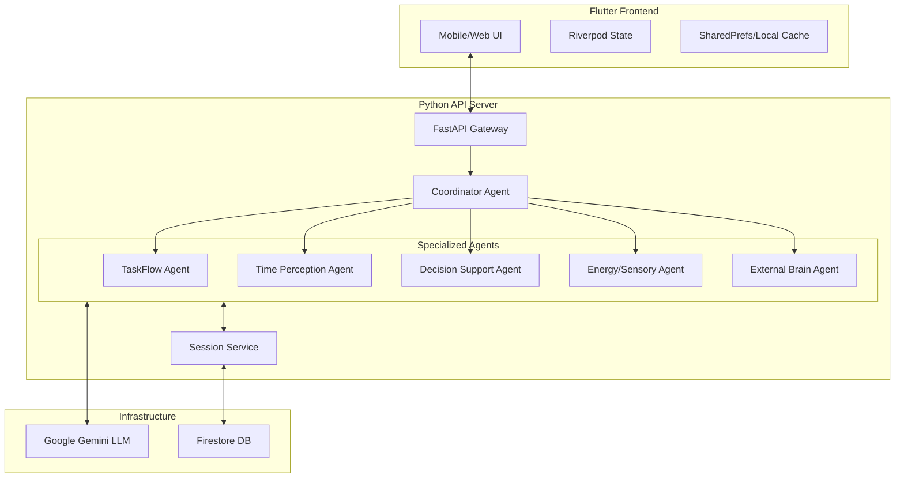

# Altered: Neuro-Inclusive Executive Function Companion

## 1. Problem Statement

### The Challenge: Executive Dysfunction
Neurodivergent adults (particularly those with ADHD and Autism) often struggle with **executive function**—the mental skills required to plan, focus attention, remember instructions, and juggle multiple tasks. Common challenges include:

*   **Time Blindness**: Difficulty perceiving the passage of time or estimating how long tasks take.
*   **Analysis Paralysis**: Inability to make decisions when faced with multiple options.
*   **Task Inertia**: Difficulty starting tasks (initiation) or stopping them (hyperfocus).
*   **Working Memory Deficits**: Losing track of context, goals, or items when interrupted.
*   **Sensory/Energy Dysregulation**: Burnout from pushing through sensory overwhelm or energy lows.

### Importance
Traditional productivity tools (calendars, to-do lists) often fail this demographic because they *require* executive function to maintain. They add cognitive load rather than reducing it. There is a critical need for a supportive, intelligent system that acts as an "external frontal lobe"—proactively managing these deficits without judgment.

---

## 2. Solution Overview

**Altered** is a multi-agent AI system designed specifically as an executive function prosthetic. Unlike passive tools, Altered proactively adapts to the user's "brain state" (Focused, Scattered, Overwhelmed) and routes requests to specialized agents.

### Key Features
*   **Task Atomization**: Breaking overwhelming projects into "micro-steps" (e.g., "Write report" → "Open document").
*   **Time Anchoring**: Visualizing time realistically and providing "transition warnings" rather than abrupt alarms.
*   **Decision Support**: Reducing choice overload by curating options and offering "gentle defaults."
*   **Body Doubling**: providing a virtual presence to assist with task initiation and maintenance.
*   **Context Restoration**: "External Brain" agent remembers where you left off, restoring context after interruptions.
*   **Energy Monitoring**: Detecting burnout patterns in communication and enforcing rest.

---

## 3. System Architecture

Altered utilizes a **Client-Server** architecture powered by **Google's Agent Development Kit (ADK)** and **Gemini** models.

### Architectural Diagram



### Components
1.  **Frontend (Flutter)**: A cross-platform (Android/iOS/Web) interface focused on minimal cognitive load.
    *   **Neuro-Inclusive UI**: Features "Focus Mode," reduced animations, and calm color palettes.
    *   **State Management**: Uses Riverpod for robust state handling.
2.  **Backend (Python/ADK)**:
    *   **Coordinator Agent**: Analyzes user intent and brain state to route tasks.
    *   **Specialized Agents**: Independent LLM-driven agents with specific "personalities" and tools.
    *   **Session Management**: Hybrid storage using in-memory speed and Firestore durability.
3.  **Data Layer**:
    *   **Firestore**: Persists chat history, user patterns, and long-term memory.

### Technology Choices
*   **Flutter**: Single codebase for mobile and web, high-performance rendering.
*   **Python + Google ADK**: Native integration with Gemini; flexible agent orchestration.
*   **Firestore**: Real-time sync and flexible schema for evolving agent memory.

---

## 4. Development Setup

### Prerequisites
*   **Python 3.10+**
*   **Flutter SDK** (Latest Stable)
*   **Google Cloud Project** with Gemini API enabled.
*   **Firebase Project** with Firestore enabled.

### Backend Setup

1.  **Clone the repository**:
    ```bash
    git clone https://github.com/BishalBudhathoki/alterred.git
    cd altered
    ```

2.  **Create Virtual Environment**:
    ```bash
    python -m venv venv
    source venv/bin/activate  # Windows: venv\Scripts\activate
    ```

3.  **Install Dependencies**:
    ```bash
    pip install -r requirements.txt
    ```

4.  **Configuration**:
    Create a `.env` file in the root directory:
    ```env
    GOOGLE_API_KEY=your_gemini_api_key
    FIREBASE_CREDENTIALS=path/to/firebase-service-account.json
    PROJECT_ID=your-project-id
    ```

5.  **Start Server**:
    ```bash
    uvicorn api_server:app --host 0.0.0.0 --port 8000 --reload
    ```

### Frontend Setup

1.  **Navigate to Frontend**:
    ```bash
    cd frontend/flutter_neuropilot
    ```

2.  **Install Packages**:
    ```bash
    flutter pub get
    ```

3.  **Run Application**:
    *   **Web (Chrome)**:
        ```bash
        # Uses scripts/run_local.sh for convenience
        ./scripts/run_local.sh
        ```
    *   **Android Emulator**:
        ```bash
        # Uses scripts/android_dev_run.sh
        ./scripts/android_dev_run.sh --device emulator-5554
        ```

> **Note**: Ensure the backend is running before starting the frontend.

---

## 5. Usage Guide

### Basic Operation
1.  **Login/Signup**: Create an account to sync your preferences and history across devices.
2.  **Home Screen**: The chat interface is the central hub.
3.  **Interaction**:
    *   Type or speak your current challenge (e.g., "I'm overwhelmed by this report").
    *   The **Coordinator** detects "Overwhelm" and activates the **TaskFlow Agent**.
    *   The agent breaks the task down: "Let's just open the document first."

### Common Use Cases

| Scenario | User Input | Active Agent | System Response |
| :--- | :--- | :--- | :--- |
| **Task Paralysis** | "I have too much to do." | TaskFlow | Offers to list tasks and pick just *one* to start for 5 minutes. |
| **Time Blindness** | "I have a meeting in an hour." | Time Perception | "That's actually 45 mins of work + 15 mins transition. Start wrapping up at X." |
| **Decision Fatigue** | "What should I eat for lunch?" | Decision Support | Presents 3 curated options based on past energy levels. |
| **Context Loss** | "Where was I?" | External Brain | "You were working on the API docs, section 3. Last edit was 2 hours ago." |

---

## 6. Project Structure

```text
altered/
├── agents/                 # Specialized agent implementations
│   ├── decision_support_agent.py
│   ├── taskflow_agent.py
│   └── ...
├── frontend/               # Flutter mobile/web application
│   └── flutter_neuropilot/
├── orchestration/          # Workflow definitions (Sequential/Parallel)
├── services/               # Core services (Auth, Firestore, Memory)
├── sessions/               # Session storage logic
├── scripts/                # Deployment and utility scripts
├── .github/workflows/      # CI/CD definitions
├── api_server.py           # FastAPI entry point
└── requirements.txt        # Python dependencies
```

---

## 7. Deployment & DevOps

This project uses **Google Cloud Platform (Cloud Run)** for the backend and **Firebase Hosting** for the frontend. Deployment is automated via **GitHub Actions** but can also be triggered manually using provided scripts.

### 7.1. Security & Configuration
Sensitive information is managed via **GitHub Secrets** and **Environment Variables**. Never commit API keys or credentials to the repository.

#### Required GitHub Secrets
Configure these in your repository settings under `Settings > Secrets and variables > Actions`:

| Secret Name | Description |
| :--- | :--- |
| `GOOGLE_API_KEY` | Gemini API Key for LLM access. |
| `FIREBASE_API_KEY` | Firebase Web API Key. |
| `FIREBASE_APP_ID` | Firebase App ID. |
| `FIREBASE_MESSAGING_SENDER_ID` | Firebase Cloud Messaging Sender ID. |
| `FIREBASE_PROJECT_ID` | Firebase Project ID. |
| `FIREBASE_AUTH_DOMAIN` | Firebase Auth Domain (e.g., `project.firebaseapp.com`). |
| `FIREBASE_STORAGE_BUCKET` | Firebase Storage Bucket URL. |
| `FIREBASE_MEASUREMENT_ID` | Google Analytics Measurement ID. |
| `GOOGLE_OAUTH_CLIENT_ID` | OAuth Client ID for Google Sign-In. |
| `GOOGLE_OAUTH_CLIENT_SECRET` | OAuth Client Secret. |
| `ENCRYPTION_KEY` | Key for encrypting sensitive user data at rest. |

#### Required GitHub Variables
Configure these under `Settings > Secrets and variables > Actions > Variables`:

| Variable Name | Description |
| :--- | :--- |
| `GCP_PROJECT_ID` | The Google Cloud Project ID. |
| `REGION` | Deployment region (e.g., `us-central1`). |
| `WIF_PROVIDER` | Workload Identity Federation Provider resource name. |
| `WIF_SERVICE_ACCOUNT` | Service Account email for GitHub Actions. |
| `OAUTH_REDIRECT_URI` | Redirect URI for OAuth flow. |

### 7.2. Automated Deployment (CI/CD)
The primary deployment method is the **GitHub Actions** workflow defined in `.github/workflows/deploy.yml`.

*   **Trigger**: Pushes to the `main` branch.
*   **Workflow Steps**:
    1.  **Backend**: Builds a Docker container, pushes to Google Container Registry (GCR), and deploys to **Cloud Run**.
    2.  **Frontend**: Installs Flutter, builds the web application (injecting secrets as compile-time constants), and deploys to **Firebase Hosting**.

### 7.3. Manual Deployment
For testing or ad-hoc updates, use the scripts in the `scripts/` directory.

#### Prerequisites
*   **Google Cloud CLI** (`gcloud`) installed and authenticated.
*   **Firebase CLI** (`firebase`) installed and authenticated.
*   **Docker** installed (for backend build).

#### Backend Deployment (Cloud Run)
Deploy the Python FastAPI server to Cloud Run:

```bash
# Usage: ./scripts/deploy_backend.sh
# Ensure you have permissions to build and deploy to the GCP project
./scripts/deploy_backend.sh
```
*   **Script Location**: `scripts/deploy_backend.sh`
*   **Action**: Builds Docker image, submits to Cloud Build, deploys to Cloud Run.

#### Frontend Deployment (Firebase Hosting)
Deploy the Flutter Web application to Firebase:

```bash
# Usage: ./scripts/deploy_frontend.sh
# Requires environment variables to be set for the build
export FIREBASE_API_KEY="your_key"
export FIREBASE_APP_ID="your_id"
# ... export other required variables ...

./scripts/deploy_frontend.sh
```
*   **Script Location**: `scripts/deploy_frontend.sh`
*   **Action**: Runs `flutter build web --release` with environment variables injected, then runs `firebase deploy --only hosting`.

### 7.4. Troubleshooting

#### Common Issues
1.  **Dependency Resolution**:
    *   If the build fails on `flutter pub get`, ensure your `pubspec.yaml` versions match the SDK version in the CI environment.
    *   For Python, check `requirements.txt` for conflicting versions.

2.  **Permission Errors**:
    *   **CI/CD**: Verify **Workload Identity Federation** is correctly configured. The Service Account must have `Cloud Run Admin`, `Service Account User`, and `Firebase Admin` roles.
    *   **Manual**: Run `gcloud auth login` and `firebase login`.

3.  **Build Failures**:
    *   **"Missing Environment Variable"**: Ensure all secrets are correctly set in GitHub or your local shell. The frontend build *will fail* if Firebase config keys are missing.
    *   **Docker Build**: Ensure `Dockerfile` is present in the root and valid.

---

> **Warning**: This project uses Generative AI. While safeguards are in place, the system may occasionally generate inaccurate information. It is a support tool, not a replacement for professional medical advice or therapy.
