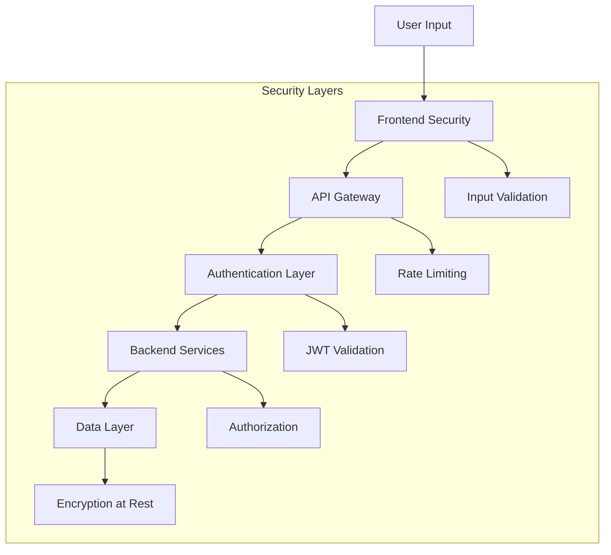

# Security Best Practices

## Overview

This document outlines the security measures implemented in the Neuropilot application and provides guidelines for maintaining security standards.

## 🔒 Security Architecture

### Multi-Layer Security Approach



### Security Components

1. **Frontend Security**
   - Input sanitization and validation
   - Secure storage of tokens
   - Content Security Policy (CSP)
   - XSS protection

2. **API Security**
   - Authentication via Firebase Auth
   - Rate limiting and throttling
   - Request validation
   - CORS configuration

3. **Backend Security**
   - Service-to-service authentication
   - Encrypted environment variables
   - Secure API key management
   - Audit logging

4. **Infrastructure Security**
   - Workload Identity Federation
   - VPC networking
   - Encrypted data transmission
   - Regular security updates

## 🛡️ Authentication & Authorization

### Firebase Authentication
- **Multi-factor authentication** support
- **OAuth providers**: Google, GitHub (configurable)
- **Session management**: Secure token refresh
- **Account security**: Password policies, account lockout

### API Authorization
```python
# Example: Protected endpoint
@require_auth
async def protected_endpoint(request: Request):
    user = request.state.user
    # Verify user permissions
    if not user.has_permission("read_data"):
        raise HTTPException(403, "Insufficient permissions")
```

### Service Account Security
- **Workload Identity Federation**: No service account keys stored
- **Least privilege**: Minimal required permissions
- **Regular rotation**: Automated credential rotation

## 🔐 Secrets Management

### GitHub Secrets Hierarchy

**Critical Secrets** (Production only):
- `ENCRYPTION_KEY`: Data encryption key
- `ADMIN_API_TOKEN`: Administrative access
- `FIREBASE_ADMIN_SA_JSON`: Service account credentials

**Environment Secrets** (Per environment):
- `FIREBASE_API_KEY_*`: Environment-specific Firebase keys
- `GOOGLE_OAUTH_CLIENT_*`: OAuth credentials per environment

### Secret Rotation Policy
- **API Keys**: Rotate every 90 days
- **Service Accounts**: Rotate every 180 days
- **Encryption Keys**: Rotate annually or on compromise
- **OAuth Secrets**: Rotate on security incidents

### Local Development Security
```bash
# Use .env.example as template
cp .env.example .env

# Never commit .env files
echo ".env" >> .gitignore

# Use environment-specific configs
export ENVIRONMENT=development
export DEBUG_MODE=true
```

## 🔍 Security Monitoring

### Automated Security Scanning

**TruffleHog Integration**:
```yaml
# .github/workflows/trufflehog.yml
- name: TruffleHog OSS
  uses: trufflesecurity/trufflehog@v3.91.0
  with:
    path: ${{ github.workspace }}
    extra_args: --only-verified
```

**Dependency Scanning**:
- **Python**: `safety check` for known vulnerabilities
- **Flutter**: `flutter analyze` for security issues
- **Node.js**: `npm audit` for package vulnerabilities

### Security Metrics
- **Failed authentication attempts**
- **API rate limit violations**
- **Suspicious access patterns**
- **Credential exposure incidents**

## 🚨 Incident Response

### Security Incident Types
1. **Credential Exposure**: API keys, passwords in code
2. **Data Breach**: Unauthorized access to user data
3. **Service Compromise**: Malicious code execution
4. **DDoS Attack**: Service availability impact

### Response Procedures

**Immediate Response** (0-1 hour):
1. **Assess Impact**: Determine scope and severity
2. **Contain Threat**: Revoke compromised credentials
3. **Notify Team**: Alert security team and stakeholders
4. **Document**: Record incident details and timeline

**Short-term Response** (1-24 hours):
1. **Investigate**: Analyze logs and access patterns
2. **Remediate**: Fix vulnerabilities and rotate secrets
3. **Monitor**: Enhanced monitoring for related threats
4. **Communicate**: Update stakeholders on progress

**Long-term Response** (1-7 days):
1. **Root Cause Analysis**: Identify underlying causes
2. **Improve Processes**: Update security procedures
3. **Training**: Security awareness for team
4. **Review**: Evaluate incident response effectiveness

### Emergency Contacts
- **Security Team**: security@neuropilot.com
- **On-call Engineer**: +1-XXX-XXX-XXXX
- **Incident Commander**: incident-commander@neuropilot.com

## 🔧 Security Configuration

### Automated Security Scanning
```bash
# Run secret scanning locally
trufflehog git file://. --only-verified

# Check for dependency vulnerabilities
npm audit
pip-audit
```

### Required Security Checks
- **Secret Scanning**: No hardcoded credentials
- **Dependency Check**: No known vulnerabilities  
- **Code Analysis**: Security-focused linting
- **Access Review**: Proper authentication/authorization

### Security Headers
```python
# FastAPI security headers
@app.middleware("http")
async def security_headers(request: Request, call_next):
    response = await call_next(request)
    response.headers["X-Content-Type-Options"] = "nosniff"
    response.headers["X-Frame-Options"] = "DENY"
    response.headers["X-XSS-Protection"] = "1; mode=block"
    response.headers["Strict-Transport-Security"] = "max-age=31536000"
    return response
```

## 📋 Security Checklist

### Development Security
- [ ] No hardcoded secrets in code
- [ ] Input validation on all endpoints
- [ ] Proper error handling (no sensitive info in errors)
- [ ] Secure dependencies (no known vulnerabilities)
- [ ] Authentication required for protected resources

### Deployment Security
- [ ] All secrets configured in GitHub
- [ ] Environment variables properly set
- [ ] HTTPS enforced for all communications
- [ ] Database connections encrypted
- [ ] Monitoring and alerting configured

### Operational Security
- [ ] Regular security updates applied
- [ ] Access logs monitored
- [ ] Incident response plan tested
- [ ] Security training completed
- [ ] Backup and recovery procedures verified

## 🔗 Security Resources

### Internal Documentation
- [Environment Setup Guide](ENVIRONMENT_SETUP.md)
- [Deployment Runbook](DEPLOYMENT_RUNBOOK.md)
- [API Security Guidelines](API_SECURITY.md)

### External Resources
- [OWASP Top 10](https://owasp.org/www-project-top-ten/)
- [Google Cloud Security](https://cloud.google.com/security)
- [Firebase Security Rules](https://firebase.google.com/docs/rules)
- [GitHub Security Features](https://docs.github.com/en/code-security)

### Security Tools
- **TruffleHog**: Secret scanning
- **Safety**: Python dependency scanning
- **Bandit**: Python security linting
- **Flutter Analyze**: Dart/Flutter security analysis

## 📞 Reporting Security Issues

If you discover a security vulnerability, please report it responsibly:

1. **Email**: security@neuropilot.com
2. **Subject**: "Security Vulnerability Report"
3. **Include**: 
   - Description of the vulnerability
   - Steps to reproduce
   - Potential impact
   - Suggested remediation

**Do not** create public GitHub issues for security vulnerabilities.

We will acknowledge receipt within 24 hours and provide a timeline for resolution.