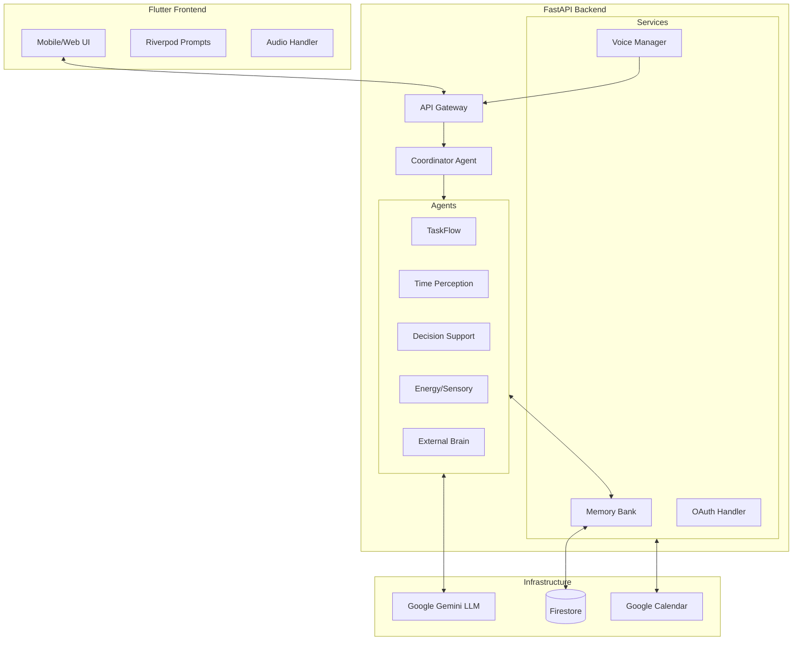

# Neuropilot System Architecture

## Overview

Neuropilot is designed as a **Neuro-Inclusive Executive Function Companion**. It uses a multi-agent system to decompose complex tasks, manage time perception, and support decision-making, tailored for users with ADHD and executive dysfunction.

## High-Level Diagram

## Core Components

### 1. The Coordinator Agent
- **Role**: The "Frontal Lobe". It receives all user input, analyzes intent and "Brain State" (e.g., Overwhelmed, Focused, Scattered), and routes the request to the appropriate sub-agent.
- **Implementation**: `agents/coordinator_agent.py` (conceptual).
- **Tools**: Can call `taskflow_tool`, `calendar_tool`, etc.

### 2. Specialized Agents
Each agent is prompts-engineered for a specific cognitive deficit:

| Agent | Focus | Key Capability |
| :--- | :--- | :--- |
| **TaskFlow** | Task Paralysis | `atomize_task`: Breaks big tasks into micro-steps. |
| **Time Perception** | Time Blindness | `create_countdown`: Visual timers with "transition warnings". `estimate_real_time`: Corrects time optimism. `detect_hyperfocus`: Monitors work duration and provides interventions. |
| **Decision Support** | Analysis Paralysis | `reduce_options`: Curates 3 viable options from many. |
| **Energy/Sensory** | Burnout/Overwhelm | `detect_energy`: Infers energy level from text tone. |
| **External Brain** | Object Permanence | `capture_context`: Remembers what you were doing. |

### 3. Memory Bank (`services/memory_bank.py`)
- **Purpose**: Provides long-term continuity.
- **Features**:
    - **Context Compaction**: Summarizes long sessions using Gemini to fit context windows.
    - **Pattern Recognition**: Learns user's "Peak Hours" and "Sensory Triggers" over time.
    - **Hybrid Caching**: Uses in-memory caching for active session summaries to reduce Firestore latency.

### 4. Voice Pipeline
Two voice modes are available:

#### Traditional Voice (`services/voice_manager.py`)
- **Input**: Opus/WebM audio stream from Flutter.
- **STT**: Google Cloud Speech-to-Text (v2) for punctuation-aware transcription.
- **Processing**: Text sent to Coordinator Agent.
- **TTS**: Hybrid system:
    - **Piper (Local)**: Fast, cheap, runs on CPU. Used for short responses or when offline/low-latency needed.
    - **Google Cloud TTS**: High-fidelity Wavenet voices. Used for longer empathetic responses.

#### Gemini Live Voice (`services/gemini_live_service.py`)
Real-time bidirectional voice using Gemini 2.0 Flash Live API:
- **WebSocket-based**: Bidirectional audio streaming over `/ws/voice`
- **Native Audio I/O**: No separate STT/TTS needed - Gemini handles both
- **Built-in VAD**: Voice activity detection prevents self-listening
- **Low Latency**: Direct audio streaming for conversational AI
- **Voice Options**: Puck, Charon, Kore, Fenrir, Aoede

## Data Schema (Firestore)

- **`users/{uid}`**
    - `profile`: Settings, API keys, preferences.
    - `memory_bank/`:
        - `strategies/`: Successful coping mechanisms.
        - `patterns/`: Energy levels, time estimation errors, hyperfocus patterns.
    - `conversations/{session_id}`:
        - `messages/`: Chat history.
        - `summary`: Compacted context.
    - `tasks/{date}/logs`: Daily task configurations.

## Security
- **Auth**: Firebase Auth (client) + Custom Bearer Token (server).
- **Encryption**: Sensitive fields (like partial API keys) are masked.
- **Privacy**: No audio is stored permanently; transcripts are stored in Firestore.
